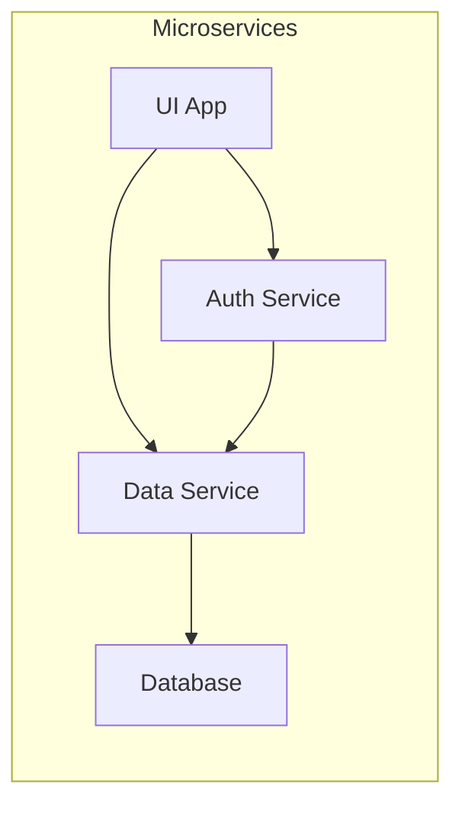
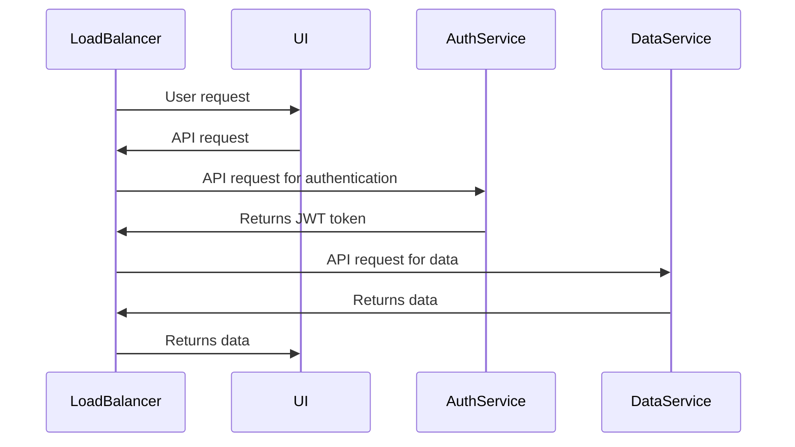

# Simple System Graph

```mermaid
graph LR
    subgraph Microservices
        UI[UI App] --> Auth
        UI --> Data
        Auth[Auth Service] --> Data
        Data[Data Service] --> DB[Database]
    end
```

# System Graph with Load Balancer

```mermaid
sequenceDiagram
  participant LoadBalancer
  participant UI
  participant AuthService
  participant DataService

  LoadBalancer->>UI: User request
  UI->>LoadBalancer: API request
  LoadBalancer->>AuthService: API request for authentication
  AuthService->>LoadBalancer: Returns JWT token
  LoadBalancer->>DataService: API request for data
  DataService->>LoadBalancer: Returns data
  LoadBalancer->>UI: Returns data

```
