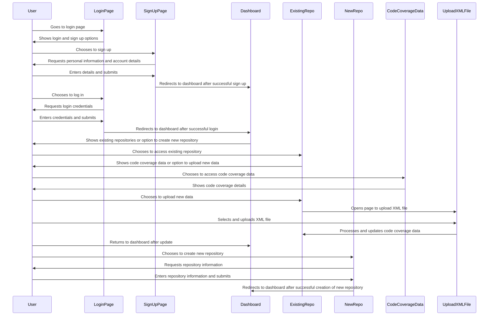

```mermaid

sequenceDiagram
    participant User
    participant LoginPage
    participant SignUpPage
    participant Dashboard
    participant ExistingRepo
    participant NewRepo
    participant CodeCoverageData
    participant UploadXMLFile

    User->>LoginPage: Goes to login page
    LoginPage->>User: Shows login and sign up options
    User->>SignUpPage: Chooses to sign up
    SignUpPage->>User: Requests personal information and account details
    User->>SignUpPage: Enters details and submits
    SignUpPage->>Dashboard: Redirects to dashboard after successful sign up
    User->>LoginPage: Chooses to log in
    LoginPage->>User: Requests login credentials
    User->>LoginPage: Enters credentials and submits
    LoginPage->>Dashboard: Redirects to dashboard after successful login
    Dashboard->>User: Shows existing repositories or option to create new repository
    User->>ExistingRepo: Chooses to access existing repository
    ExistingRepo->>User: Shows code coverage data or option to upload new data
    User->>CodeCoverageData: Chooses to access code coverage data
    CodeCoverageData->>User: Shows code coverage details
    User->>ExistingRepo: Chooses to upload new data
    ExistingRepo->>UploadXMLFile: Opens page to upload XML file
    User->>UploadXMLFile: Selects and uploads XML file
    UploadXMLFile->>ExistingRepo: Processes and updates code coverage data
    User->>Dashboard: Returns to dashboard after update
    User->>NewRepo: Chooses to create new repository
    NewRepo->>User: Requests repository information
    User->>NewRepo: Enters repository information and submits
    NewRepo->>Dashboard: Redirects to dashboard after successful creation of new repository

```
